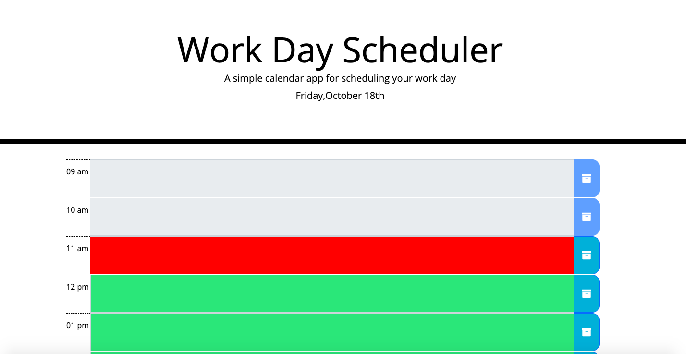
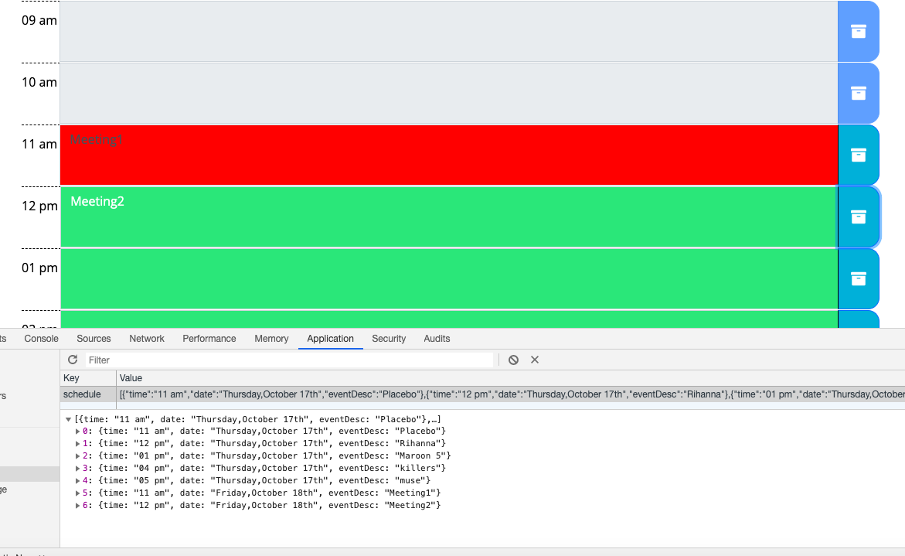
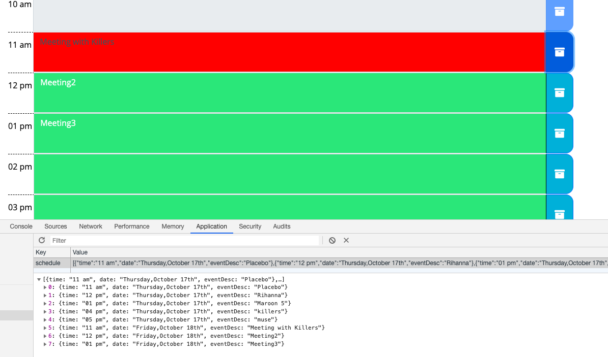
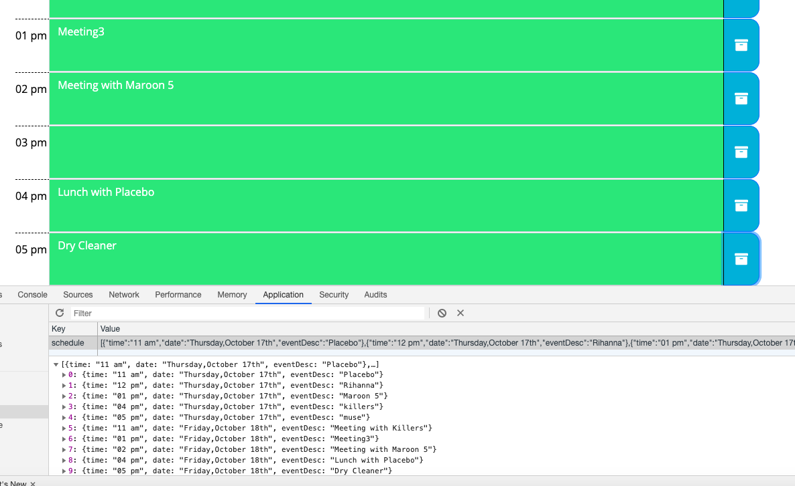
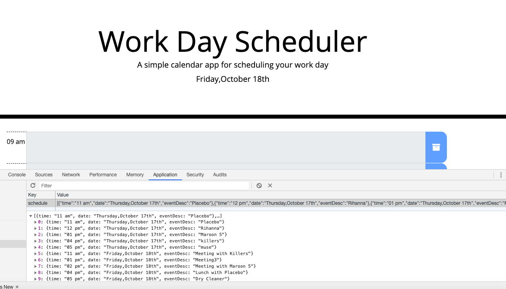
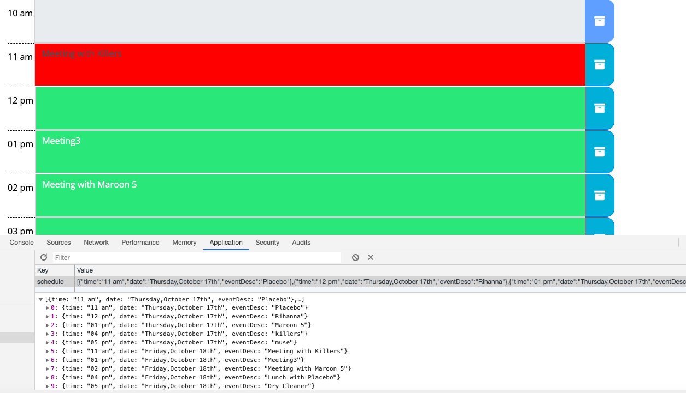
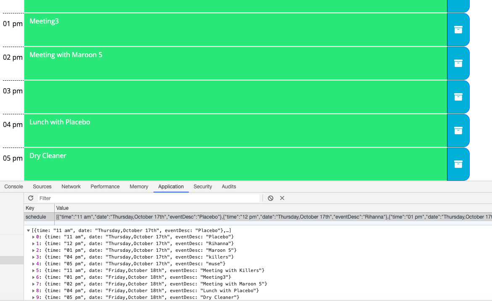

# DAILY PLANNER

## About: ##

This is a simple calendar application that allows the user to save events for each hour of the day. This app runs in the browser and features dynamically updated HTML and CSS powered by jQuery.

## Installation: ##

    You can check the running project:
    
   

## Usage: ##

   - When the user runs the application, he is presented with a daily calendar where the current date is shown on top.
     The app displays standard business hours (9 a.m. to 5 p.m.). Each time slot represents one hour and contains the following: 

     * The time
     * A field to hold user input
     * A save button

    Clicking on the save button stores the time and user input in localStorage. Additionally, each hour is color coded to reflect whether the time slot is in the past (gray), the present (red), or the future (green). This changes depending on the time of the day. The past time events won't be updated or deleted since the corresponding text fields and buttons will be disabled.

     
     
     ---------------------------------------------------------------------------------------------------

   - Here, we are in the time-block 11:00-12:00. If we enter "Meeting1" at 11 am time-block and "Meeting2" at 12 pm time-block and press the store buttons for both. The local storage will be as shown below. There maybe some entries from previous dates. Even if the page is refreshed, the changes persist.

     

     --------------------------------------------------------------

   - If we update "Meeting1" with "Meeting with Killers" at 11 am time block and add "Meeting3" at 01 pm time-block, the page and local storage will be as shown below: 

     

     -----------------------------------------------------------------------------------------------------

   - If we delete "Meeting2" and press the submit button and refresh, the page and the local storage will be as shown below:

     

- If we enter few more events at later times, the result page and the local storage will be as shown below
    
     

- If we refresh again, page will look like below:

     

     

     

---------------------------------------------------------------------------------------------------------------------------

## How: ##

* When the page is loaded, "init" function is fired up. First, current date is shown in the header. Afterwards, the object list will be taken from the local storage since the user might have already entered some events on the current day. If there are previously entered events, for each event we will check the DOM and show the events on the corresponding text fields if current date and time matches the DOM objects. This way events from the storage will be shown on the page. For each time objects that belongs to the "hour class", we'll compare it to the current time. This is done by using "moment.js" library for queries and current time. If the event happened in the past, the color of the text field will be changed to gray; if it is current hour, it'll be changed to red and if it's in the future, the text field color will be green. Those are accomplished by manipulating the css dynamically.

* When user enters an event and hits the "store" button, "storeLocal" function will be fired up. First, we'll get the id of the button and extract the index from it. If  it's 0-->matches to the time 9 am, if it's  1-->matches to the time 10 am etc. Then we'll create an "events" object with the fields; time, date and event description. We will check if event is already stored in the local storage (This is accomplished by comparing the time fields). If it is stored, the event description will be updated. If user entered empty string and event exists in the storage, event will be removed from the storage. If event does not exist in the storage, new event entry will be added to the storage. If the event does not exist in the storage and user enters an empty event, it'll have no effect whatsoever. If we delete all the events, null will be stored in the local storage.

* Dates and times from another day in the local storage won't effect the program.

## Credits: ## 

I'm greatful for our instructor Omar Patel and TA's Tyler Bray, Matthew Calimbas and PeterPark for their help on the issues encountered in the process of developing this application.

The web sites that I found useful while implementing the application are listed below:

  * https://getbootstrap.com/docs/4.3/getting-started/introduction/
  * https://momentjs.com/docs/
  * https://www.freecodecamp.org/learn/front-end-libraries/jquery/
  
## Licence: ##

Anybody is welcomed to copy code snippets and test it out.

## Limitations: ##

 None